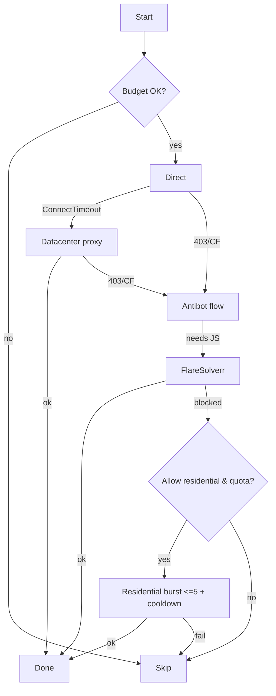
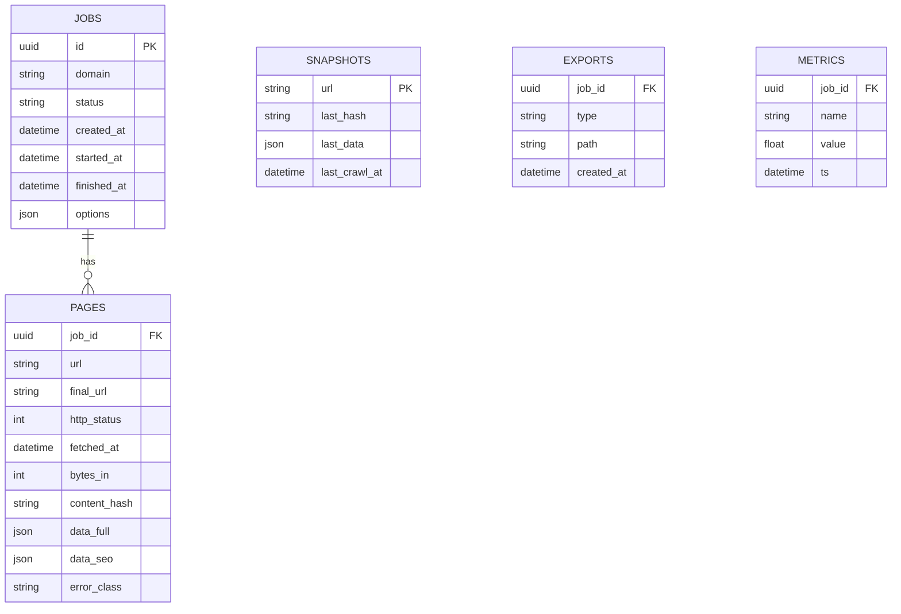
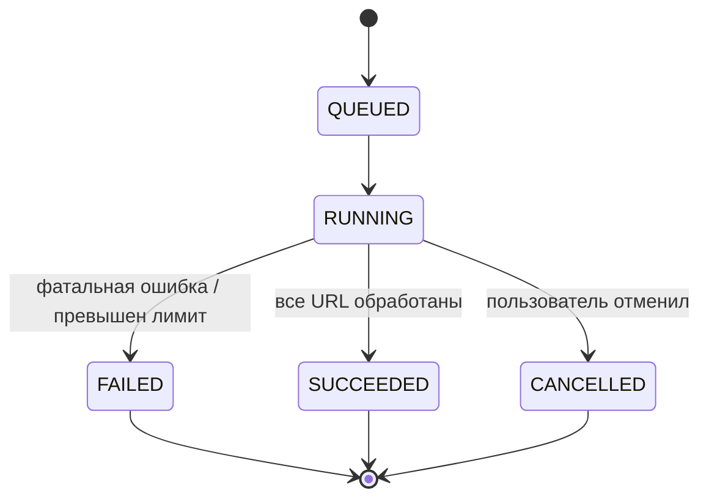
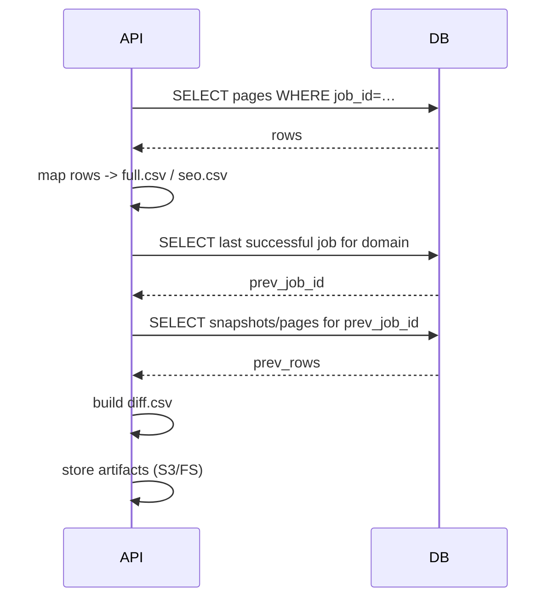

# Архитектура (как это работает)

## 3.1. Системный контур
```mermaid
flowchart LR
  U[User] -->|Upload sitemap| UI[Next.js App]
  UI --> API[FastAPI Backend]
  API --> Q[Redis Queue]
  W[Worker Pool] -->|fetch/parse| Site[Target Sites]
  W --> PM[ProxyManager]
  W --> FS[FlareSolverr]
  W --> DB[(Postgres/SQLite)]
  W --> ST[Object Storage (S3/FS)]
  API --> MET[Prometheus Exporter]
  UI <-->|SSE logs/metrics| API
  UI -->|Download CSV| ST
```

**Ключевые компоненты**
- **Next.js (App Router)** — загрузка sitemap, запуск job, live‑лог, прогресс, экспорт артефактов.
- **FastAPI** — REST/WS API, приём job’ов, валидация настроек, постановка задач в очередь, выдача CSV/XLSX.
- **Redis + RQ/Celery** — очередь задания → URL батчи.
- **Worker’ы (Python)** — цепочка httpx → antibot → FlareSolverr → residential burst; запись результатов.
- **ProxyManager** — управление DC пулом, health-check, квоты на residential, стратегия fallback.
- **СУБД** — Postgres (prod) / SQLite (dev) для pages, snapshots, job metadata.
- **Object Storage** — S3 или файловая система для CSV/JSON/логов job.
- **Prometheus/Grafana** — сбор метрик, алерты по ошибкам и бюджетам.

| Компонент        | Язык/Технология      | Роль                                                 |
|------------------|----------------------|------------------------------------------------------|
| Next.js App      | TypeScript / React   | UI: загрузка sitemap, live-лог, мониторинг, экспорт  |
| FastAPI API      | Python               | REST/WebSocket API, постановка job’ов, сбор экспортов |
| Redis + RQ/Celery| Redis / Python       | Очередь задач, переиспользование/ретраи URL          |
| Worker Pool      | Python               | Обход URL, парсинг, вызов ProxyManager/FlareSolverr  |
| ProxyManager     | Python               | Управление стратегиями обхода и квотами прокси       |
| СУБД             | Postgres / SQLite    | Таблицы jobs, pages, snapshots, metrics              |
| Object Storage   | Amazon S3 / FS       | Хранение CSV, JSON, логов                            |
| Monitoring       | Prometheus / Grafana | Метрики, алерты, дашборды                            |

## 3.2. Диаграмма развертывания
```mermaid
graph LR
  subgraph VPC
    API[FastAPI] --> R[Redis Cluster]
    API --> DB[(Postgres)]
    API --> ST[S3 / FS Storage]
    W[Workers] --> R
    W --> ST
    W --> FS[FlareSolverr]
  end
  UI[Next.js (server / static)] --> API
  User --> UI
```

## 3.3. Последовательность запроса
```mermaid
sequenceDiagram
  participant UI as Next.js
  participant API as FastAPI
  participant Q as Redis Queue
  participant W as Worker
  participant PM as ProxyManager
  participant FS as FlareSolverr
  participant DB as DB/Storage

  UI->>API: POST /jobs (sitemap + options)
  API->>Q: enqueue(URL batch)
  loop for each URL
    W->>PM: select strategy (direct/DC)
    W->>Site: GET
    alt blocked/CF/403 or needs JS
      W->>FS: browser solve
    end
    alt still blocked & quotas allow
      W->>PM: residential burst (<=5; cooldown)
    end
    W->>DB: store result + metrics
  end
  UI->>API: GET /jobs/:id/export?type={full|seo|diff}
  API->>DB: build CSV
  API-->>UI: download link
```

## 3.4. Решающее дерево «дешево → дорого»


## 3.5. Экономия трафика и ресурсов
- Content-type whitelist: `text/html`, `application/json`.
- Early stop по маркерам `</html>`/`</body>`, ограничение `max_html_bytes`.
- Gzip/Brotli, стриминговое чтение (chunked).
- Дедуп URL, исключение `/static/`, `/assets/`, `*.pdf`, `*.jpg` и т.п.
- Token-bucket бюджеты: глобальный / per-site / residential (soft/hard stop).
- Circuit breaker: разные типы ошибок, half-open режим, recovery-порог.

## 3.6. Антибот и прокси
- DC-пул с health-check (успешность, латентность, исключение плохих хостов).
- FlareSolverr подключается только после успешного TCP (не лечит ConnectTimeout).
- Residential burst — последний шаг, ≤5 попыток подряд, адаптивный cooldown, отдельные квоты.
- Session isolation: cookies/сессии не пересекаются между Residential и DC-пулами.

## 3.7. Парсинг (универсальный + шаблоны)
- Generic parser: CSS/XPath + эвристики, fallback при отсутствии шаблонов.
- Platform detectors: Bitrix, WordPress/WooCommerce, CS-Cart, InSales — готовые селекторы полей (name/sku/price/availability/attrs/images).
- SEO extractor: `<title>`, `meta[name=description]`, `og:*`, `twitter:*`, `link[rel=canonical]`, `meta[name=robots]`, `hreflang`, `h1`, `alt`.

## 3.8. Diff
- Ключ — `url`.
- Сравнение с последним успешным job того же домена.
- `change_type`: `ADDED`, `REMOVED`, `MODIFIED`, `UNCHANGED`.
- `fields_changed`: список полей; для price/availability/title — отдельные колонки `_prev`/`_curr`.

## 3.9. Данные и хранилища
- DB: Postgres (prod) / SQLite (dev). Таблицы: `jobs`, `pages`, `snapshots`, `exports`, `metrics`.
- Storage: `data/jobs/<job_id>/full.csv|seo.csv|diff.csv` + JSON снапшоты.
- Retention: хранить N последних job на домен (например, 10).

## 3.10. Безопасность и комплаенс
- Секреты: `.env`/secret manager, маскирование токенов в логах.
- `robots.txt` и Terms of Service — уважение по умолчанию, конфигурируемые override.
- Исключаются авторизованные и платные зоны (никаких логинов без явного разрешения).

## 3.11. Интеграция и расширяемость
- **Очереди**: вместо Redis/RQ можно подключить Kafka, RabbitMQ, AWS SQS; интерфейс абстрагирован в модуле job queue.
- **Внешние прокси**: ProxyManager принимает плагины — подключайте Storm Proxies, Oxylabs, Smartproxy через унифицированный интерфейс.
- **Дополнительные парсеры**: можно добавить GraphQL/JSON-API обработчики для SPA; воркер определяет тип ответа и вызывает соответствующий адаптер.
- **Webhook/REST-hooks**: FastAPI может публиковать события в Slack/Teams/HTTP webhook после завершения job.

## 3.12. Infrastructure as Code
- **Helm chart**: основные параметры — `replicaCount`, `resources`, `env`, `ingress`, `hpa`. Пример values:
  ```yaml
  replicaCount: 3
  resources:
    limits:
      cpu: "1"
      memory: 2Gi
    requests:
      cpu: 250m
      memory: 512Mi
  env:
    PROXY_URL: "${PROXY_URL}"
  ```
- **Kubernetes манифест** (упрощённый):
  ```yaml
  apiVersion: apps/v1
  kind: Deployment
  metadata:
    name: scraper-api
  spec:
    replicas: 2
    selector:
      matchLabels:
        app: scraper-api
    template:
      metadata:
        labels:
          app: scraper-api
      spec:
        containers:
          - name: api
            image: ghcr.io/org/scraper-api:latest
            envFrom:
              - secretRef:
                  name: scraper-secrets
            ports:
              - containerPort: 8000
  ---
  apiVersion: v1
  kind: Service
  metadata:
    name: scraper-api
  spec:
    selector:
      app: scraper-api
    ports:
      - port: 80
        targetPort: 8000
  ```
- **Terraform**: описываем S3 bucket, Redis instance, Postgres (RDS или CloudSQL), Prometheus/Grafana (managed).

## 3.13. Глоссарий и SLA
**Глоссарий**
- **Direct/DC** — прямое соединение без прокси / через datacenter proxy.
- **Residential burst** — кратковременное использование residential прокси (до 5 подряд) при исчерпании остальных стратегий.
- **Budget** — лимит по трафику (MB) или количеству попыток для конкретного пула.
- **Circuit breaker** — механизм останова при превышении ошибки/таймаутов с фазой half-open.
- **Snapshot** — сохранённый JSON/CSV результат для diff.

**SLA-метрики**
- Время ответа воркера: < 30 сек на URL (без SPA) при нормальной сети.
- Ошибки `ConnectTimeout` — не более 5% URL (rolling 5 минут).
- Успех без residential — ≥ 95% URL.
- Точность diff (отсутствие ложных `MODIFIED`) — ≥ 98% (по выборочной проверке).

## 3.14. Схема данных


## 3.15. Жизненный цикл job


## 3.16. Последовательность экспорта


## 3.17. Модель ошибок
| Класс           | Примеры                         | Действие оркестратора                            |
|----------------|---------------------------------|--------------------------------------------------|
| NetworkTimeout | ConnectTimeout, ECONNRESET      | fail-fast; до 2 ретраев; переход к следующей стратегии |
| HTTPRetryable  | 429, 503                        | экспоненциальный backoff, до 4 ретраев           |
| BotBlock       | 403, Cloudflare challenge       | запуск antibot, затем FlareSolverr               |
| JSRequired     | пустой DOM, динамические страницы | FlareSolverr / Playwright                        |
| QuotaExceeded  | превышение трафика/лимитов      | мягкий стоп (soft) или остановка (hard)          |
| Fatal          | 5xx backend, parser crash       | job → FAILED, логирование + алерт               |

## 3.18. Безопасность и секреты
- Секреты: локально `.env`, в проде — secret manager (AWS Secrets Manager/Vault).
- Маскирование в логах: пароли, токены, cookies. HTML ≥ 16 KB не логируем.
- Логи: retention 14 дней (dev), 30 дней (prod), смежные политики SIEM.
- Доступ к FlareSolverr/Playwright — через сервисные аккаунты, запуск под ограниченным пользователем.
```
